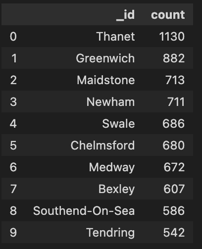

# nosql-challenge
- Module 12 Challenge
- Steph Abegg

## Task
For this module’s Challenge, we were tasked with importing a JSON file of food establishment ratings data to a MongoDB database and conducting analysis to help a food magazine make decisions about their future articles. 

## Deliverables 

This Challenge had two Deliverables:

1. Deliverable 1: A Jupyter notebook ([NoSQL_setup.ipynb](NoSQL_setup.ipynb)) containing code that imports the data and sets up and updates the uk_food database.

2. Deliverable 2: A Jupyter notebook ([NoSQL_analysis.ipynb](NoSQL_analysis.ipynb)) containing code that performs the exploratory analysis queries in the database.

## Setup Summary

Below I summarize the various operations performed to the data in the NoSQL_setup.ipynb file.

In the setup, I imported the data and set up the uk_food database. I made some modifications/updates, including:

(1) Added a new entry for Penang Flavours restaurant,

(2) Updated the BusinessTypeID of this new entry,

(3) Removed all documents with the LocalAuthorityName of Dover,

(4) Updated the latitude and longitude to decimal numbers,

(5) Set non-numerical ratings to null and changed numerical ratings to integers.

## Analysis Summary

Below I give the main results from the analysis done in the NoSQL_analysis.ipynb file.

There are 41 establishments with a hygiene score of 20.

There are 33 establishments in London with a RatingValue greater than or equal to 4.

The Business names of the top 5 establishments with a Rating Value of 5, sorted by lowest hygiene score, within 0.01 degree of the 'Penang Flavours' restaurant: "Howe and Co Fish and Chips - Van 17", "Lumbini Grocery Ltd T/A Al-Iman", "Plumstead Manor Nursery", "Iceland", "Volunteer". 

(Note that this analysis is somewhat misleading. There are 66 establishments with a rating value of 5, hygiene score of 0, and within 0.01 degree of the restaurant 'Penang Flavours'. However, we were told to just give the names of the "top 5" - unless we did some math to figure out how close each actually was to the 'Penang Flavours' restaurant and sorted by this distance as well, there are more than 5 that are equivalent under the given criteria.)

There are 55 Local Authority areas that have at least one establishment with hygiene score of 0. The first 10 Local Authority areas, sorted by number of establisments with a hygiene score of 0, are:

## External Sources

I modeled my code off of the activities from class, and used XPert Learning Assistant on occasion for quick coding help. 
